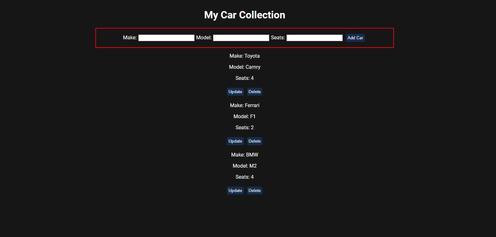

# Fullstack application - Car management app

This is a web application built with tthe following: (Node, Express, React). Simple implementation of CRUD operations in the form of a cars list.

## Features

- Add new car info.
- Delete new a car.
- Update a car info.
- View the cars list.

## Usage

- The app uses a local json file to store the cars list.
- Express for backend.
- React for the frontend.

#### To use the app locally.
- Clone the repository
- Navigate to the backend & frontend via a terminal and type in both. `npm install`.
- Navigate to the backend and type, `npm run dev` and frontend `npm start`.

## Screenshots

*Screenshot 1: App page*